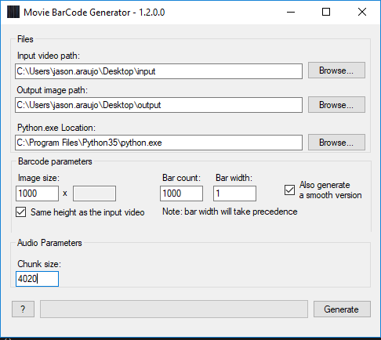

# Movie BarCode Generator

A user friendly tool to generate movie barcodes.

More information here: [zerowidthjoiner.net/movie-barcode-generator](https://zerowidthjoiner.net/movie-barcode-generator)

## Summary: 

This project has been updated to read a directory and process all movie files in that directory.
It will also make use [CineSculptures Audio](https://github.com/zombience/CineSculptures_Audio) in order to process .wav files to generate images. 

The CineSculptures repo has been included as a git submodule in this repo. 

## Getting Started with this Repo: 
Download [ffmpeg](http://ffmpeg.org)
Ensure that you have Python35 for CineSculptures. It may work in Python36, but has not been tested
Install OpenCV for python via: `python -m pip install opencv-python`
After cloning repo, make sure to get python submodule via:
	* git submodule init
	* git submodule update

Open .sln and make a build.
Python files and .dlls will be automatically copied to the same folder as the .exe

If you'd like to move the .exe somewhere else, make sure that the following files and directories are included in the same directory as the .exe:
	* audio_processing directory and all .py files 
	* all .dll files
	* ffmpeg.exe
	* MovieBarCodeGenerator.exe

## Example results

With the "Smooth bars" feature enabled:

## About the code

This tool is mostly a wrapper around [FFmpeg](http://ffmpeg.org/).

A copy of ffmpeg.exe must be placed next to the main executable for it to work.

All the code in this repository is released under the GPL license. see [License.txt](License.txt) for more information.

The code has been written relatively quickly (a few hours), but should be of acceptable quality.

There might be buggy corner cases though.

## Known Issues:
The app hangs when trying to overwrite target files that were created previously with the generator. 

For the old legacy version based on DirectShow and released in 2011, [see here](https://github.com/mlaily/MovieBarCodeGenerator-Legacy).
